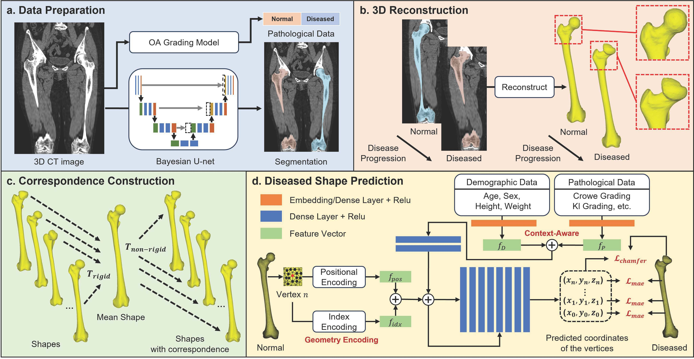

# FemurSurfacePrediction

This is the implementation of the paper 'Prediction of Disease-Related Femur Shape Changes Using Geometric Encoding and Clinical Context on a Hip Disease CT Database.' 

The code will be updated soon.

  

